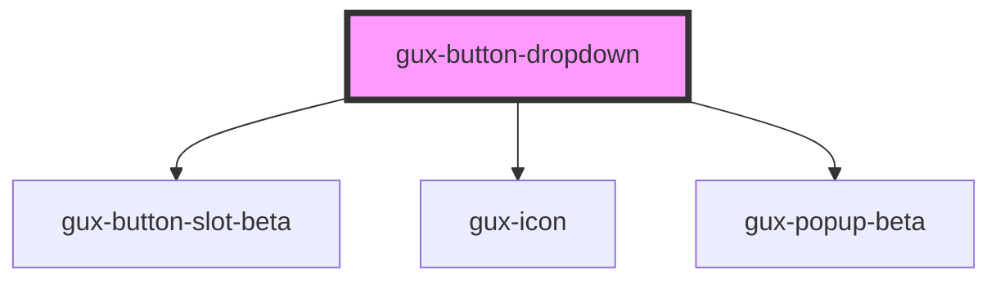

# gux-action-button
An action button. In order to use this element toggle children must be slotted in.

Example usage
```html
<gux-action-button text="Button Text">
  <gux-action-item value="test" text="test"/>
  <gux-action-item value="test2" text="test2"/>
  <gux-action-item value="test3" text="test3"/>
</gux-action-button>
```

<!-- Auto Generated Below -->


## Properties

| Property    | Attribute   | Description                                  | Type                                     | Default       |
| ----------- | ----------- | -------------------------------------------- | ---------------------------------------- | ------------- |
| `accent`    | `accent`    | The component accent (secondary or primary). | `"primary" \| "secondary" \| "tertiary"` | `'secondary'` |
| `disabled`  | `disabled`  | Disables the action button.                  | `boolean`                                | `false`       |
| `expanded`  | `expanded`  | It is used to open or not the list.          | `boolean`                                | `false`       |
| `text`      | `text`      | The component text.                          | `string`                                 | `undefined`   |
| `type`      | `type`      | The component button type                    | `"button" \| "reset" \| "submit"`        | `'button'`    |
| `variation` | `variation` | The component variation (multi or action).   | `string`                                 | `'multi'`     |


## Events

| Event         | Description                                 | Type               |
| ------------- | ------------------------------------------- | ------------------ |
| `actionClick` | Triggered when the action button is clicked | `CustomEvent<any>` |
| `close`       | Triggered when the menu is close            | `CustomEvent<any>` |
| `open`        | Triggered when the menu is open             | `CustomEvent<any>` |


## Dependencies

### Depends on

- [gux-button-slot-beta](../gux-button-slot)
- [gux-icon](../../stable/gux-icon)
- [gux-popup-beta](../gux-popup)

### Graph


----------------------------------------------

*Built with [StencilJS](https://stenciljs.com/)*
